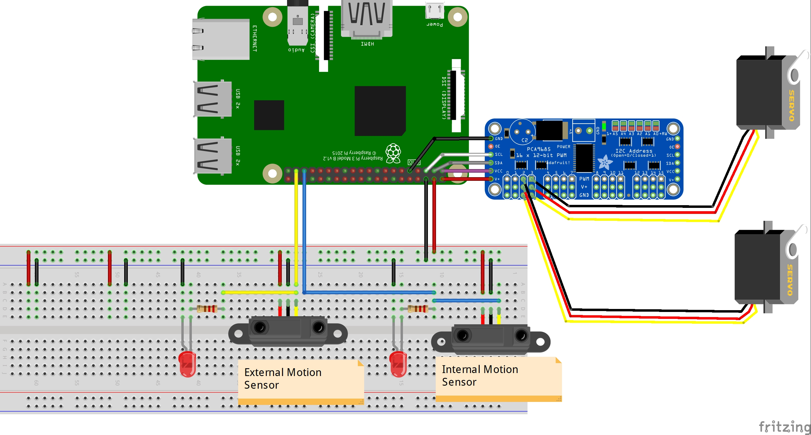

# Pet Recognition Door Project

This project employs computer vision to ensure that your cat will have exclusive entry access to your home. The door is motion-activated, and will unlock only when it detects a cat face.

As an exercise, you can extend this project by implementing any of the following features:

A user interface to view photos of animals that tried to re-enter the house.
A dashboard that displays information on the frequency of your cat’s comings and goings.
An option to re-train the classifier using images of your cat.
A text-messaging system that sends images of animals blocked from entering the house, with the option for a reply to manually override the classifier’s decision.

## INITIAL SETUP

1. Set up your PC and Raspberry Pi or MinnowBoard according to [these instructions](https://developer.microsoft.com/en-us/windows/iot/Docs/GetStarted/mbm/sdcard/stable/GetStartedStep1.htm).

2. Plug in your USB webcam, keyboard, and mouse into your device.

3. Next, wire up the PIR motion sensors, servos and LEDs as shown below.

## HARDWARE SETUP

Cut one end of each servo plate with a saw so that it's flush with the edge of the servo, as shown in the image below. This will enable the pet door to open completely without hitting the servo plates.

Next, drill holes at the top of the pet door to house the LEDs and motion sensors. The holes should be slightly larger than each sensor.

Finally, use a 3D printer to print off two servo connectors and, if you want, a half case. We've provided a MinnowBoard half case in our attachments.

Attach the servo connectors to your servos on the side of the door opposite the existing stoppers. This allows your servos to control the opening and closing of the pet door.

## SOFTWARE SETUP

1. Use Command Prompt to navigate to the folder where you want the project:

cd <your folder path>

2. Run the git clone command to download the project:

git clone https://github.com/ms-iot/PetDoor.git

3. Open the PetDoor.sln solution file, in the PetDoor folder you just downloaded, using Visual Studio 2017.

4. Download OpenCV, build it, and add the built binaries to your project by following [these instructions](https://developer.microsoft.com/en-us/windows/iot/samples/opencv).

4. On the top menu of Visual Studio, select Debug and ARM if you are using a Raspberry Pi, or Debug and x86 if you're using a MinnowBoard.

5. Press Remote Machine. In the "Remote Connections" dialog you will have to enter your Remote Machine IP address. You can find your IP address using the IoT Dashboard, available for download here.

## SOFTWARE USE

This app has an optional UI, which displays the camera stream along with the most recent capture when the motion detector is triggered. It can also run in headless mode without a display. The door automatically unlocks when it detects motion indoors. When motion is detected outdoors, images are sampled from the webcam and then run through the OpenCV image classifier. The classifier returns a vector of detected cat faces within the images, and if it is non-empty, the door is unlocked!

Helpful tip:

The LEDs connected to each motion sensor will light up when their respective motion sensor is triggered and outputs 5V.
